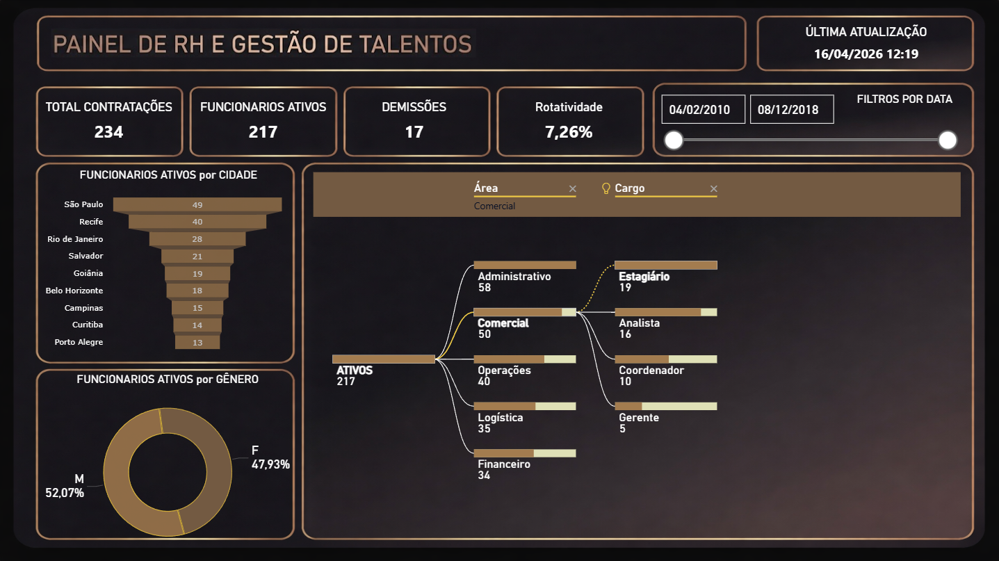
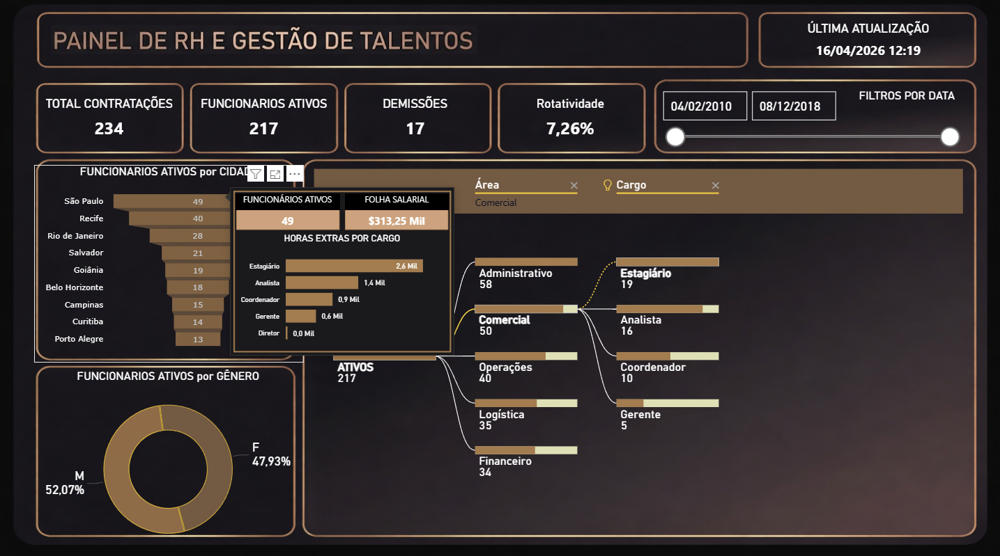

# HR Analytics - Luxury Dark Dashboard 📊

Este projeto consiste em um dashboard estratégico de **People Analytics** desenvolvido no Power BI. O objetivo é monitorar indicadores-chave (KPIs) de RH, permitindo uma análise profunda da força de trabalho com um design sofisticado e focado em UX (User Experience).

---

## 🖼️ Visualização do Projeto

### Painel Principal
Visão geral dos KPIs de contratação, ativos e rotatividade, com distribuição geográfica e demográfica.

### Insights Detalhados (Tooltip)
Ao passar o mouse sobre os dados, o painel revela detalhes da folha salarial e horas extras por cargo, otimizando o espaço de tela.

---

## 🚀 Principais Funcionalidades

* **KPIs em Tempo Real:** Monitoramento de Contratações, Ativos, Demissões e Turnover (7,26%).
* **Árvore de Decomposição:** Análise hierárquica por Área e Cargo para identificar gargalos ou concentrações de pessoal.
* **Tooltips Dinâmicos:** Visualização secundária de dados financeiros (Folha Salarial e Horas Extras) sem poluir o visual principal.
* **Filtros Avançados:** Segmentação por data e interatividade total entre os gráficos de cidade e gênero.

---

## 🛠️ Tecnologias Utilizadas

* **Power BI:** Construção dos visuais e dashboards.
* **DAX (Data Analysis Expressions):** Criação de medidas calculadas para KPIs de rotatividade e ativos.
* **Power Query:** Tratamento e modelagem dos dados.
* **UI/UX Design:** Figma/Power BI para o layout "Luxury Dark".

---

## 👤 Autor

**Murillo Marins**

---

### 🤝 Contato
* **LinkedIn:** [Murillo Marins](https://www.linkedin.com/in/murillo-marins-200316253/)
* **GitHub:** [Mu-grills](https://github.com/Mu-grills/Mu-grills)
